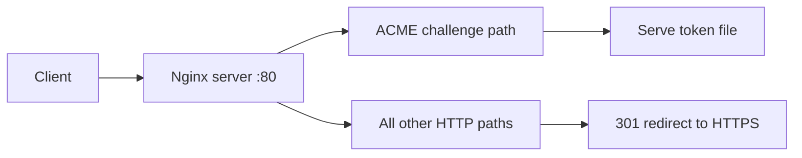

Use this guide when Nginx should serve ACME HTTP-01 challenge files while redirecting all other HTTP traffic to HTTPS.

## Request Flow



## Minimal Example

```nginx
server {
    listen 80;
    server_name example.com www.example.com;

    location ^~ /.well-known/acme-challenge/ {
        # Strip the location prefix and serve token files from this directory.
        alias /var/www/acme/;
        default_type text/plain;
    }

    location / {
        return 301 https://$host$request_uri;
    }
}
```

## Why This Is Correct

- The official `location` docs say a `^~` prefix location is selected before regular expression locations are checked.
- The official `alias` directive replaces the matched location prefix with the configured filesystem path.
- The official `return` directive can send a `301` redirect to the HTTPS version of the current URL.

## Before You Use It

- Replace the example host names with your real domains.
- Create the challenge directory and let your ACME client write token files into it.
- Ensure the Nginx worker user and any host security policy can read the challenge directory.
- Confirm the HTTPS server on port 443 already exists before enabling the redirect.
- Run `nginx -t`, then reload with `nginx -s reload`.

## Official References

- https://nginx.org/en/docs/http/ngx_http_core_module.html#location
- https://nginx.org/en/docs/http/ngx_http_core_module.html#alias
- https://nginx.org/en/docs/http/ngx_http_rewrite_module.html