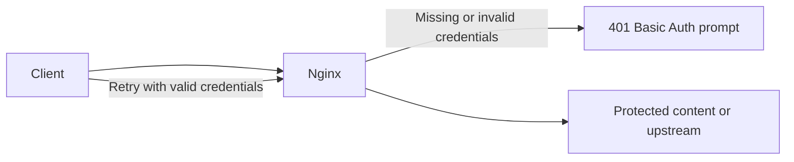

Use this guide when you want Nginx to require a browser username and password before serving or proxying a protected path.

## Request Flow



## Minimal Example

```nginx
location / {
    # Realm label shown in the browser login prompt.
    auth_basic "Restricted Area";
    # Password file in htpasswd-compatible format.
    auth_basic_user_file /etc/nginx/.htpasswd;
}
```

## Create the Password File with OpenSSL

```bash
USERNAME="demo"
PASSWORD_HASH="$(openssl passwd -apr1)"
printf '%s:%s\n' "$USERNAME" "$PASSWORD_HASH" | sudo tee /etc/nginx/.htpasswd >/dev/null
```

- `openssl passwd -apr1` prompts for a password and returns an Apache `apr1` hash.
- The Nginx auth basic module docs list `openssl passwd` and `apr1` hashes as supported for `auth_basic_user_file`.
- Replace `demo` and `/etc/nginx/.htpasswd` so they match your real username and config path.

## Why This Is Correct

- The official `ngx_http_auth_basic_module` docs use the same two directives.
- `auth_basic` enables HTTP Basic Authentication and sets the realm string.
- `auth_basic_user_file` points to the password file with allowed users.
- Both directives are valid in `http`, `server`, `location`, and `limit_except` contexts. This example uses `location /` because it is the clearest way to protect one path.

## Before You Use It

- Paste the block into an existing `server {}` that already serves or proxies your app.
- Create the password file before reloading Nginx.
- Run `nginx -t`, then reload with `nginx -s reload`.

## Official References

- https://nginx.org/en/docs/http/ngx_http_auth_basic_module.html
- https://nginx.org/en/docs/beginners_guide.html