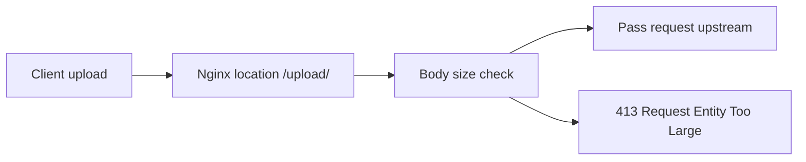

Use this guide when one Nginx location should accept larger uploads before proxying them to an application.

## Request Flow



## Minimal Example

```nginx
server {
    listen 80;
    server_name _;

    location /upload/ {
        # Allow request bodies up to 20 MB for this upload path.
        client_max_body_size 20m;
        proxy_pass http://127.0.0.1:8080;
    }
}
```

## Why This Is Correct

- The official docs say `client_max_body_size` is valid in `http`, `server`, and `location` contexts.
- The official docs say requests larger than the configured limit receive a `413` error.
- The official docs also say the default limit is `1m`, so a larger value is often needed for uploads.

## Before You Use It

- Replace the sample upstream with your real upload handler.
- Adjust the size limit for your actual upload policy.
- Keep the directive at the narrowest scope that matches your use case.
- Run `nginx -t`, then reload with `nginx -s reload`.

## Official References

- https://nginx.org/en/docs/http/ngx_http_core_module.html#client_max_body_size
- https://nginx.org/en/docs/beginners_guide.html