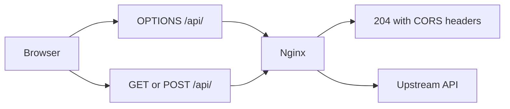

Use this guide when Nginx should answer browser CORS preflight requests for one known frontend origin before proxying API traffic.

## Request Flow



## Minimal Example

```nginx
location /api/ {
    if ($request_method = OPTIONS) {
        add_header Access-Control-Allow-Origin "https://app.example.com" always;
        add_header Access-Control-Allow-Methods "GET, POST, OPTIONS" always;
        add_header Access-Control-Allow-Headers "Authorization, Content-Type" always;
        add_header Access-Control-Max-Age 86400 always;
        return 204;
    }

    add_header Access-Control-Allow-Origin "https://app.example.com" always;
    proxy_pass http://127.0.0.1:8080;
}
```

## Why This Is Correct

- The official headers module docs allow `add_header` in `location` and in `if` inside a location.
- The official rewrite module docs allow `if ($request_method = OPTIONS) { ... }` and `return 204;` in a location context.
- This example keeps the `if` block narrow and ends it with an immediate `return 204;`, which avoids turning the location into a larger conditional routing pattern.
- The example uses one explicit allowed origin instead of `*`, which keeps the configuration honest and avoids implying a wildcard-plus-credentials pattern.

## Before You Use It

- Replace `https://app.example.com` with the exact frontend origin you want to allow.
- Adjust allowed methods and request headers to match your real API.
- Reduce `Access-Control-Max-Age` if you need faster rollback of CORS policy changes.
- If your upstream API already sets CORS headers, remove one side so browsers do not receive duplicate CORS headers.
- If you need credentialed cross-site requests, keep an explicit origin and add credentials handling intentionally instead of switching to `*`.
- Run `nginx -t`, then reload with `nginx -s reload`.

## Official References

- https://nginx.org/en/docs/http/ngx_http_headers_module.html
- https://nginx.org/en/docs/http/ngx_http_rewrite_module.html