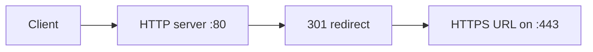

Use this guide when one Nginx server should redirect plain HTTP requests to the HTTPS version of the same URL.

## Request Flow



## Minimal Example

```nginx
server {
    listen 80;
    server_name example.com www.example.com;

    # Redirect every HTTP request to the same host and URI over HTTPS.
    return 301 https://$host$request_uri;
}
```

## Why This Is Correct

- The official `return` directive supports a redirect status code and a URL with variables.
- `listen` and `server_name` are standard server-level directives in the `server {}` context.
- `return` stops further processing and sends the redirect immediately.

## Before You Use It

- Replace the example server names with your real host names.
- Configure a matching HTTPS server on port 443 before enabling the redirect.
- Run `nginx -t`, then reload with `nginx -s reload`.

## Official References

- https://nginx.org/en/docs/http/ngx_http_rewrite_module.html
- https://nginx.org/en/docs/http/ngx_http_core_module.html