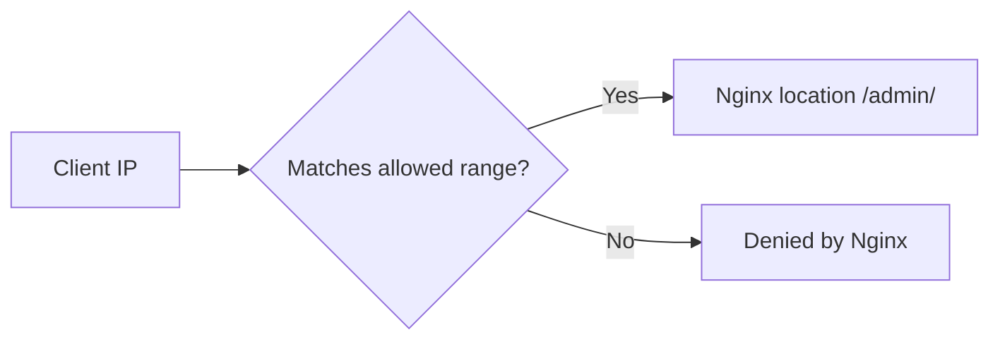

Use this guide when a Nginx location should be reachable only from known client IP ranges such as office or VPN networks.

## Request Flow



## Minimal Example

```nginx
location /admin/ {
    allow 203.0.113.0/24;
    allow 2001:db8:1234::/48;
    deny all;
}
```

## Security Note

- If Nginx sits behind a proxy, load balancer, or CDN, these rules may evaluate the proxy address instead of the real client address.
- Configure trusted real-IP handling first when proxy addresses are involved.
- Test with both allowed and denied client paths before using this in production.
```

## Why This Is Correct

- Behind a proxy, address-based access control is only meaningful after real-IP handling is correct.
- The official access module docs use `allow` and `deny` directives to limit access by client address or CIDR range.
- The official docs say the rules are checked in sequence until the first match is found.
- The final `deny all;` closes the location to every client outside the trusted ranges.

## Before You Use It

- Replace the sample IPv4 and IPv6 ranges with the exact networks you control.
- Keep the rule order intentional because the first matching rule wins.
- If Nginx sits behind a trusted proxy or load balancer, configure real-IP handling before relying on address-based access rules.
- Run `nginx -t`, then reload with `nginx -s reload`.

## Official References

- https://nginx.org/en/docs/http/ngx_http_access_module.html
- https://nginx.org/en/docs/http/ngx_http_realip_module.html