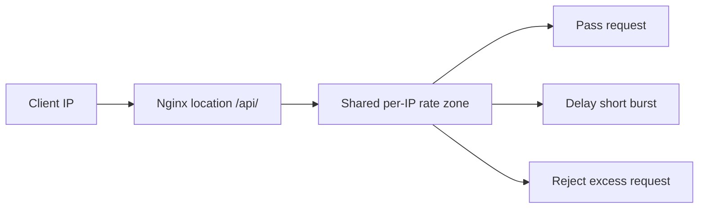

Use this guide when you want Nginx to limit how many requests one client IP can send in a short period.

## Request Flow



## Minimal Example

```nginx
http {
    # Use a shared memory zone keyed by client IP.
    limit_req_zone $binary_remote_addr zone=perip:10m rate=1r/s;

    server {
        listen 80;
        server_name _;

        location /api/ {
            # Allow a short burst before requests are rejected.
            limit_req zone=perip burst=5;
            proxy_pass http://127.0.0.1:8080;
        }
    }
}
```

## Why This Is Correct

- The official `ngx_http_limit_req_module` docs describe `limit_req_zone` plus `limit_req` as the request-rate limiting path.
- The official docs explicitly say this module limits request processing rate per key, including per client IP.
- `limit_req_zone` is valid only in the `http` context, so the zone definition stays at that level.
- The official docs recommend `$binary_remote_addr` for the IP key because it uses a fixed-size binary representation.

## Why This Uses `limit_req`

- `limit_req` limits request rate.
- `limit_conn` limits concurrent connections, which is a different control.

## Before You Use It

- Replace `http://127.0.0.1:8080` with your real upstream or adapt the protected location.
- Put the example into your active Nginx configuration so the `limit_req_zone` line stays inside `http {}`.
- Run `nginx -t`, then reload with `nginx -s reload`.

## Official References

- https://nginx.org/en/docs/http/ngx_http_limit_req_module.html
- https://nginx.org/en/docs/http/ngx_http_limit_conn_module.html