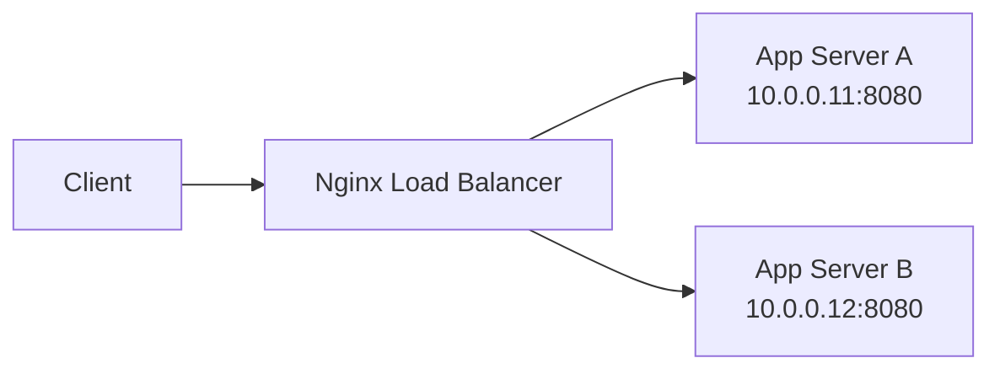

Use this guide when one Nginx server should distribute requests across two backend application servers.

## Request Flow



## Minimal Example

```nginx
http {
    upstream app_backend {
        # Nginx uses round-robin here by default.
        server 10.0.0.11:8080;
        server 10.0.0.12:8080;
    }

    server {
        listen 80;
        server_name _;

        location / {
            # Send every incoming request to the upstream group.
            proxy_pass http://app_backend;
        }
    }
}
```

## Why This Shape Is Easy to Read

- `upstream app_backend` groups the backend servers under one name.
- `proxy_pass http://app_backend;` tells Nginx to forward requests to that group.
- Multiple `server` lines inside the same `upstream` block use round-robin balancing unless you configure another method.

## Before You Use It

- Replace the sample IP addresses and port with your real backend servers.
- Put the example inside your active `http {}` context or an included site config.
- Run `nginx -t` before reloading the service.

## Intentionally Left Out

This is the smallest readable baseline, so it does not include TLS, health checks, sticky sessions, or forwarded headers.