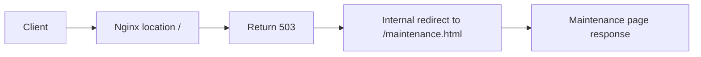

Use this guide when Nginx should return a maintenance page for every request during planned downtime.

## Request Flow



## Minimal Example

```nginx
server {
    listen 80;
    server_name _;

    error_page 503 /maintenance.html;

    location / {
        return 503;
    }

    location = /maintenance.html {
        root /srv/www;
        internal;
    }
}
```

## Why This Is Correct

- The official `return` directive can send a `503` response immediately.
- The official `error_page` directive can internally redirect that response to a maintenance file.
- The official `internal` directive keeps the maintenance file location inaccessible from direct external requests.

## Before You Use It

- Put a real `maintenance.html` file under `/srv/www` or replace that path with your real maintenance page directory.
- Ensure the Nginx worker user and any host security policy can read the maintenance page directory.
- Add more specific exceptions before `location /` if you need to keep health checks or challenge paths available.
- Run `nginx -t`, then reload with `nginx -s reload`.

## Official References

- https://nginx.org/en/docs/http/ngx_http_core_module.html#error_page
- https://nginx.org/en/docs/http/ngx_http_core_module.html#internal
- https://nginx.org/en/docs/http/ngx_http_rewrite_module.html