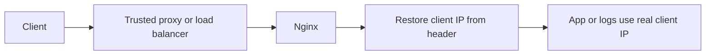

Use this guide when Nginx sits behind a trusted proxy and should restore the real client IP address from forwarded headers.

## Request Flow



## Minimal Example

```nginx
http {
    set_real_ip_from 10.0.0.0/8;
    real_ip_header X-Forwarded-For;
    real_ip_recursive on;

    server {
        listen 80;
        server_name _;

        location / {
            proxy_pass http://127.0.0.1:8080;
        }
    }
}
```

## Why This Is Correct

- The official real-IP module docs use `set_real_ip_from`, `real_ip_header`, and `real_ip_recursive` together in their example configuration.
- The official docs say `set_real_ip_from` must list only addresses or CIDR ranges that are trusted to send correct replacement addresses.
- The official docs say `real_ip_recursive on;` makes Nginx use the last non-trusted address in the forwarded chain.

## Before You Use It

- Replace `10.0.0.0/8` with the exact trusted proxy or load balancer ranges in your environment.
- Never trust the open Internet or an overly broad range just to make the config easier.
- Confirm your Nginx build includes `ngx_http_realip_module`.
- Run `nginx -t`, then reload with `nginx -s reload`.

## Official References

- https://nginx.org/en/docs/http/ngx_http_realip_module.html
- https://nginx.org/en/docs/http/ngx_http_proxy_module.html