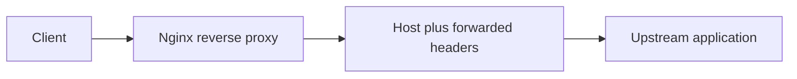

Use this guide when Nginx should pass the standard reverse proxy headers to an upstream application.

## Request Flow



## Minimal Example

```nginx
location / {
    proxy_pass http://127.0.0.1:8080;

    proxy_set_header Host $host;
    proxy_set_header X-Real-IP $remote_addr;
    proxy_set_header X-Forwarded-For $proxy_add_x_forwarded_for;
    proxy_set_header X-Forwarded-Proto $scheme;
}
```

## Why This Is Correct

- The official proxy module docs use `proxy_set_header Host $host;` and `proxy_set_header X-Real-IP $remote_addr;` in their example configuration.
- The official proxy module exposes `$proxy_add_x_forwarded_for` so you can extend the incoming `X-Forwarded-For` chain with the current client address.
- The core module exposes `$scheme`, so the upstream app can see whether the original request arrived over HTTP or HTTPS.

## Before You Use It

- Replace the sample upstream address with your real application.
- Keep this header set on the proxied location that fronts the app.
- If Nginx itself sits behind another trusted proxy, pair this with a real-IP snippet first.
- Run `nginx -t`, then reload with `nginx -s reload`.

## Official References

- https://nginx.org/en/docs/http/ngx_http_proxy_module.html
- https://nginx.org/en/docs/http/ngx_http_core_module.html