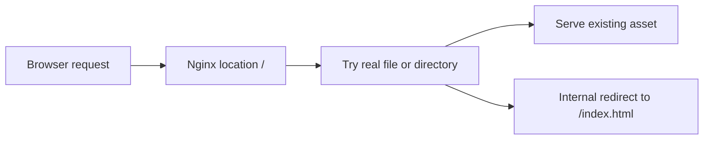

Use this guide when Nginx should serve a single-page app and fall back to `index.html` for client-side routes.

## Request Flow



## Minimal Example

```nginx
server {
    listen 80;
    server_name _;
    root /srv/www/app;

    location / {
        # Serve an existing file first, otherwise fall back to the SPA entry point.
        try_files $uri $uri/ /index.html;
    }
}
```

## Why This Is Correct

- The official `try_files` directive checks files in order and internally redirects to the last parameter when nothing matches.
- The official `root` directive makes the request path resolve under the configured document root.
- Putting this logic in `location /` makes it the catch-all for routes that are not handled elsewhere.

## Before You Use It

- Put your built SPA files under `/srv/www/app` or replace that path with your real build output directory.
- Ensure the Nginx worker user and any host security policy can read the configured directory.
- Add more specific locations before this catch-all if your app also serves APIs or uploads through Nginx.
- Run `nginx -t`, then reload with `nginx -s reload`.

## Official References

- https://nginx.org/en/docs/http/ngx_http_core_module.html#try_files
- https://nginx.org/en/docs/http/ngx_http_core_module.html#root