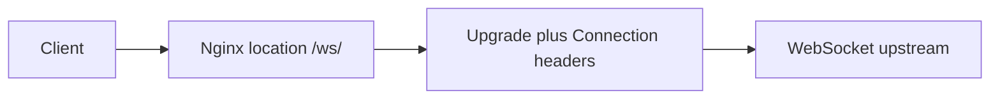

Use this guide when Nginx should proxy WebSocket traffic to an upstream service.

## Request Flow



## Minimal Example

```nginx
location /ws/ {
    proxy_pass http://127.0.0.1:8080;
    proxy_http_version 1.1;
    proxy_set_header Upgrade $http_upgrade;
    proxy_set_header Connection "upgrade";
    proxy_read_timeout 300s;
}
```

## Why This Is Correct

- The official WebSocket proxying guide says `Upgrade` and `Connection` are hop-by-hop headers and must be passed explicitly.
- The official guide shows `proxy_set_header Upgrade $http_upgrade;` and `proxy_set_header Connection "upgrade";` for the WebSocket location.
- This snippet keeps `proxy_http_version 1.1;` explicit so the example stays compatible across older and newer Nginx deployments.
- The official guide also points to `proxy_read_timeout` for longer idle WebSocket connections.

## Before You Use It

- Replace the sample upstream with your real WebSocket service.
- Keep this config on the dedicated WebSocket location instead of a generic catch-all.
- Adjust the read timeout for your application's idle behavior.
- Run `nginx -t`, then reload with `nginx -s reload`.

## Official References

- https://nginx.org/en/docs/http/websocket.html
- https://nginx.org/en/docs/http/ngx_http_proxy_module.html