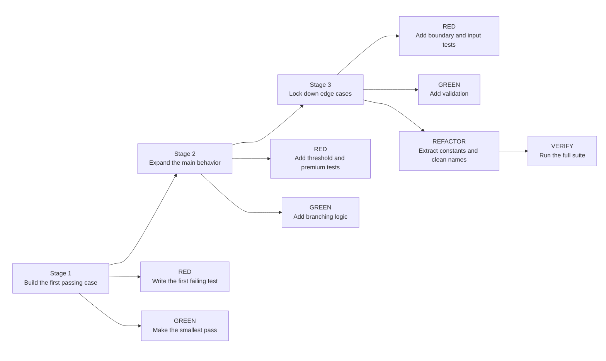
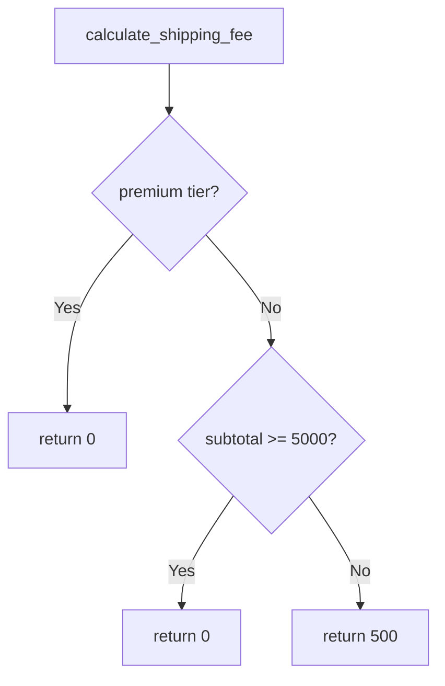

Use this guide when you want to practice one small TDD loop in Python instead of reading TDD as theory.

## Learning Flow



## What You Will Build

You will grow one tiny function:

```python
calculate_shipping_fee(subtotal_cents: int, customer_tier: str = "standard") -> int
```

Rules for the example:

- Standard orders below 5000 cents pay 500 cents shipping.
- Standard orders at or above 5000 cents get free shipping.
- Premium customers always get free shipping.
- Invalid input should fail loudly.

## Rule Map



## Step 1: RED

Start with one failing test in `tests/test_calculate_shipping_fee.py`:

```python
def test_uses_standard_tier_by_default_below_threshold(self):
    self.assertEqual(500, calculate_shipping_fee(3000))
```

Run the suite:

```bash
python -m unittest discover -s tests -p "test_*.py"
```

The first signal should be a failure because the function does not exist yet.

## Step 2: GREEN

Create the smallest passing implementation in `src/calculate_shipping_fee.py`:

```python
def calculate_shipping_fee(subtotal_cents: int, customer_tier: str = "standard") -> int:
    return 500
```

Run the suite again and stop as soon as the first test passes.

## Step 3: RED

Add two more behavior tests:

```python
def test_returns_free_shipping_at_threshold(self):
    self.assertEqual(0, calculate_shipping_fee(5000, "standard"))


def test_premium_customer_always_gets_free_shipping(self):
    self.assertEqual(0, calculate_shipping_fee(1000, "premium"))
```

Run the suite and let those new tests fail.

## Step 4: GREEN

Replace the hard-coded return with the smallest real branching logic:

```python
if customer_tier == "premium":
    return 0
if subtotal_cents >= 5000:
    return 0
return 500
```

Do not refactor yet. Make the new tests pass first.

## Step 5: RED

Now add input and boundary tests:

```python
def test_rejects_negative_subtotal(self):
    with self.assertRaises(ValueError):
        calculate_shipping_fee(-100, "standard")


def test_rejects_bool_subtotal(self):
    with self.assertRaises(TypeError):
        calculate_shipping_fee(True, "standard")


def test_rejects_unknown_customer_tier(self):
    with self.assertRaises(ValueError):
        calculate_shipping_fee(3000, "gold")


def test_charges_shipping_just_below_threshold(self):
    self.assertEqual(500, calculate_shipping_fee(4999, "standard"))
```

This step matters because TDD is not only about the happy path. It is also how you lock down edge cases.

## Step 6: GREEN

Add the smallest validations that make the suite pass:

Check `bool` before `int` because `True` and `False` are instances of `int` in Python.

```python
if isinstance(subtotal_cents, bool):
    raise TypeError("subtotal_cents must be an integer")
if not isinstance(subtotal_cents, int):
    raise TypeError("subtotal_cents must be an integer")
if subtotal_cents < 0:
    raise ValueError("subtotal_cents must be greater than or equal to 0")
if customer_tier not in {"standard", "premium"}:
    raise ValueError("customer_tier must be 'standard' or 'premium'")
```

Keep the change small. The goal is green tests, not a perfect design on the first try.

## Step 7: REFACTOR

Now clean up the code without changing behavior:

- Lift `5000` and `500` into named constants.
- Keep the public function signature the same.
- Re-run the full suite after each small cleanup.

Final implementation:

```python
FREE_SHIPPING_THRESHOLD_CENTS = 5000
STANDARD_SHIPPING_FEE_CENTS = 500


def calculate_shipping_fee(subtotal_cents: int, customer_tier: str = "standard") -> int:
    """Return the shipping fee in cents for one order."""
    # Flow: validate subtotal -> validate tier -> premium stays free -> threshold decides standard fee
    if isinstance(subtotal_cents, bool):
        raise TypeError("subtotal_cents must be an integer")
    if not isinstance(subtotal_cents, int):
        raise TypeError("subtotal_cents must be an integer")
    if subtotal_cents < 0:
        raise ValueError("subtotal_cents must be greater than or equal to 0")
    if customer_tier not in {"standard", "premium"}:
        raise ValueError("customer_tier must be 'standard' or 'premium'")

    if customer_tier == "premium":
        return 0
    if subtotal_cents >= FREE_SHIPPING_THRESHOLD_CENTS:
        return 0
    return STANDARD_SHIPPING_FEE_CENTS
```

## Final Check

Run the suite one last time:

```bash
python -m unittest discover -s tests -p "test_*.py"
```

If the tests stay green after the cleanup, you finished a real RED -> GREEN -> REFACTOR loop.